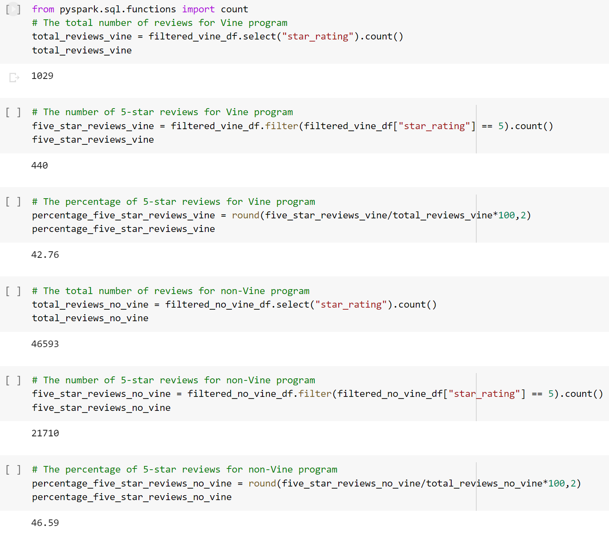
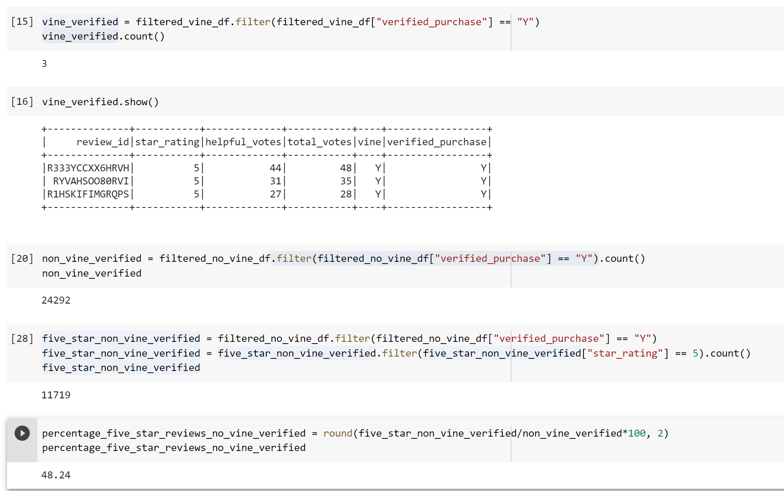

# Amazon_Vine_Analysis

## Overview
The purpose of this project is to perform an ETL process with AWS RDS instance to pgAdmin using PySpark. After that, an analysis is performed to determine if there is any bias toward favorable reviews from Vine members.

## Results

- There were 1029 Vine reviews and 46593 non-Vine reviews.

- 440 Vine reviews and 21710 non-Vine reviews were 5 stars.

- 42.76% of Vine reviews and 46.59% of non-Vine reviews were 5 stars.

## Summary
Since there are even higher percentage of 5-star reviews for non-Vine program than Vine program, there is no evidence that there is any positivity bias for reviews in the Vine program.

In addition, an additional analysis could be performed with the dataset to support the above statement.

The additional analysis is focused on 5-star reviews where they are also verified purchases.

By filtering the Vine dataframe where "verified_purchase" is "Y", there are only 3 reviews in which they are all 5-star reviews.

On the other hand, when the non-Vine dataframe was filtered where "verified_purchase" is "Y", there were 24292 reviews.

Among those reviews, another filter was applied to count only 5-star reviews, and there were 11719 5-star reviews.

As a result, the percentage of 5-star verified purchase reviews for non-Vine program was 48.24%. Since this percentage is even higher than the previous one (46.59%), the statement where there is no evidence of bias can be supported.